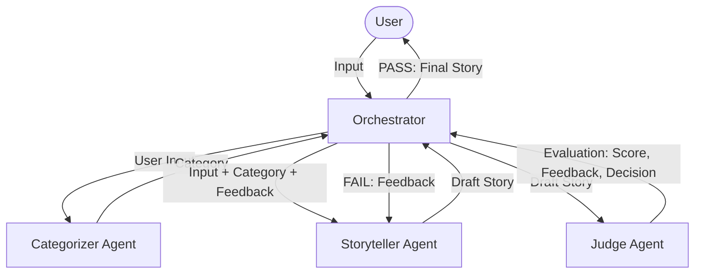

# Bedtime Story Generator 🌙

A robust, multi-agent system designed to generate high-quality, age-appropriate bedtime stories for children aged 5-10. This project utilizes an agentic workflow featuring a Storyteller, a Judge, and a Categorizer to ensure every story follows a classic narrative arc and meets strict quality standards.

## 🚀 Key Features

- **Multi-Agent Orchestration**: 
  - **Categorizer**: Identifies the genre (Fable, Adventure, Mystery, etc.) to tailor the story's tone.
  - **Storyteller**: Drafts engaging narratives using classic story arcs.
  - **Judge**: Critically evaluates stories for age-appropriateness and engagement, providing feedback for refinement.
- **Self-Refinement Loop**: The system automatically revises stories based on Judge feedback if the initial quality score is low.
- **High Resilience**:
  - **API Error Handling**: Gracefully manages rate limits and quota issues.
  - **Fallback Library**: Provides pre-verified "canned" stories if the LLM service is unavailable.
- **Prompt Engineering & Analytics**:
  - **Modular Prompts**: Prompts are stored in `prompts/` for easy iteration.
  - **A/B Testing**: Support for versioned prompt testing (e.g., `v1` vs `v2`).
  - **Performance Tracking**: Logs metrics like success rate, average score, and latency to `prompt_metrics.jsonl`.

## 🛠️ System Architecture

The system follows a **Research -> Categorize -> Generate -> Judge -> Refine** loop.



Detailed design notes can be found in [SYSTEM_DESIGN.md](./SYSTEM_DESIGN.md).

## 📋 Setup & Installation

### Prerequisites
- Python 3.9+
- OpenAI API Key

### Installation
1. **Clone the repository**:
   ```bash
   git clone https://github.com/Ishan315/bedtime-story-generator.git
   cd bedtime-story-generator
   ```

2. **Set up virtual environment**:
   ```bash
   python3 -m venv .venv
   source .venv/bin/activate  # On Windows: .venv\Scripts\activate
   ```

3. **Install dependencies**:
   ```bash
   pip install -r requirements.txt
   ```

4. **Configure Environment**:
   - Create a `.env` file in the root directory.
   - Add your OpenAI API key:
     ```env
     OPENAI_API_KEY=your_sk_...
     ```

## 🎮 Usage

### Generate a Story
Run the main script and follow the interactive prompt:
```bash
python main.py
```

### Run Analytics
To view the performance metrics and A/B testing results:
```bash
python view_stats.py
```

### Run Tests
To verify the system's robustness and logic:
```bash
python test_main.py
```

## 🧪 Prompt A/B Testing
To test a new version of prompts:
1. Create a new folder under `prompts/` (e.g., `prompts/v2/`).
2. Add your modified `storyteller.md`, `judge.md`, or `categorizer.md` files there.
3. Update the `prompt_version` in `main.py`:
   ```python
   orchestrator = StoryOrchestrator(agent, prompt_version="v2")
   ```
4. Run the script and compare results using `view_stats.py`.

---
*Developed for the Hippocratic AI Coding Assignment.*
