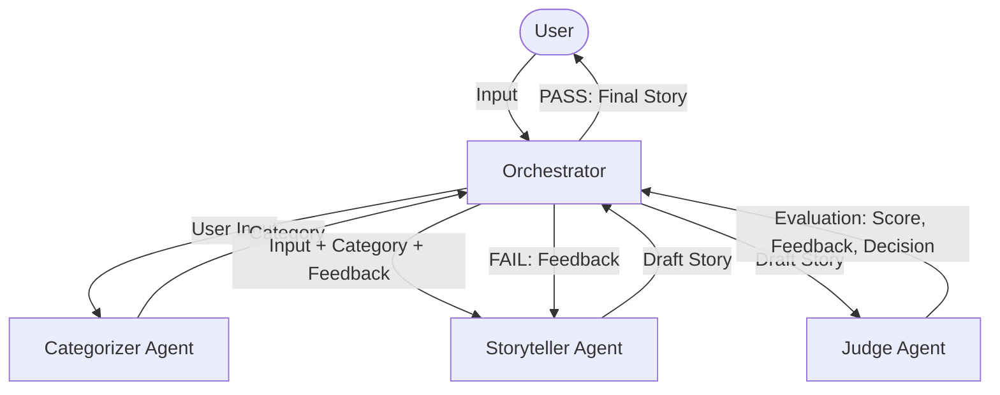

# System Design: Bedtime Story Agent

This document outlines the architecture and flow of the Bedtime Story Agent system.

## Block Diagram

You can view the interactive diagram here: [Bedtime Story Agent System Diagram](https://www.figma.com/board/HQjdbCTdvaMiMmNN513r52?utm_source=other&utm_content=edit_in_figjam&oai_id=&request_id=8b7607ae-dcc2-499a-8647-6e6025694bf6)

### Mermaid Flowchart

## Component Roles

1.  **User**: Provides the initial story request (e.g., "A story about a brave squirrel").
2.  **Orchestrator**: The central brain that manages the state machine and communication between agents.
3.  **Categorizer Agent**: Analyzes the user input to determine the story's genre (Fable, Adventure, Mystery, etc.), allowing the Storyteller to adopt a more specific tone. Runs on **GPT-3.5-Turbo**.
4.  **Storyteller Agent**: Uses the user input, category, and any previous feedback to draft a high-quality bedtime story with a structured narrative arc. Runs on **GPT-3.5-Turbo**.
5.  **Judge Agent**: Evaluates the story based on age-appropriateness (5-10 years), narrative quality, engagement, and positive messaging. It provides a numeric score and specific feedback for refinement. Runs on **GPT-4o** (Best Practice: using a stronger model for evaluation prevents self-bias and ensures rigorous quality control).

## Refinement Loop
If the Judge Agent gives a score lower than 8, the Orchestrator passes the feedback back to the Storyteller for a second attempt. This ensures that the final output meets a high standard of quality.
